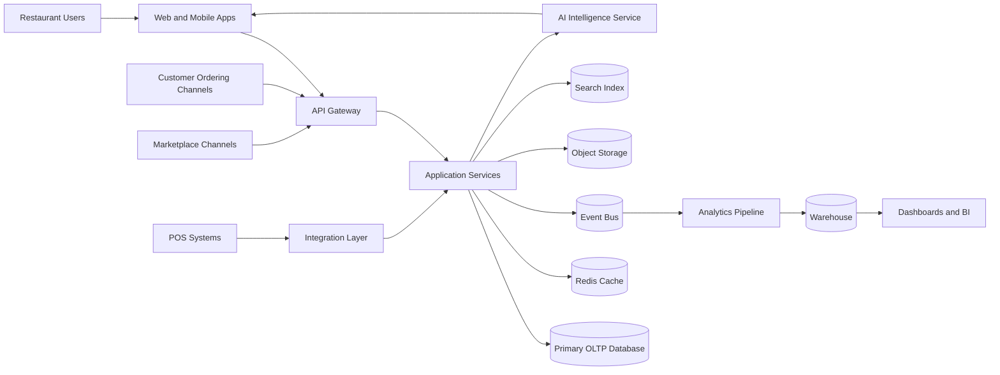
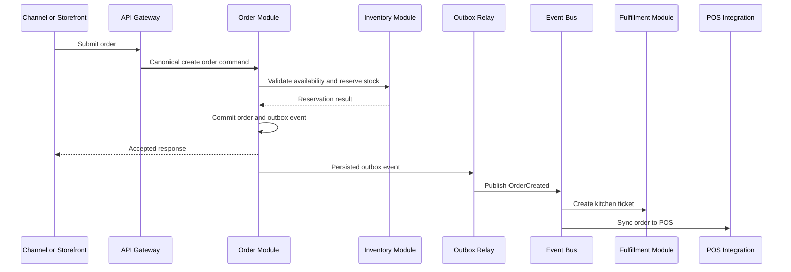
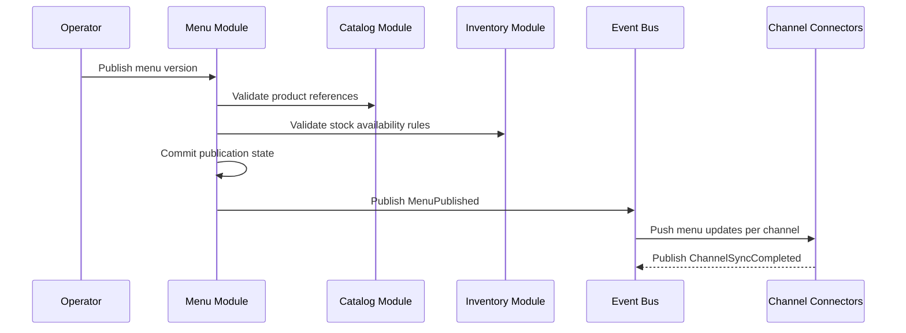
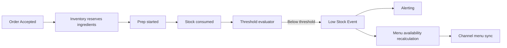
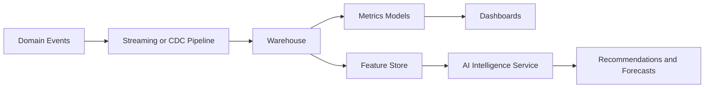
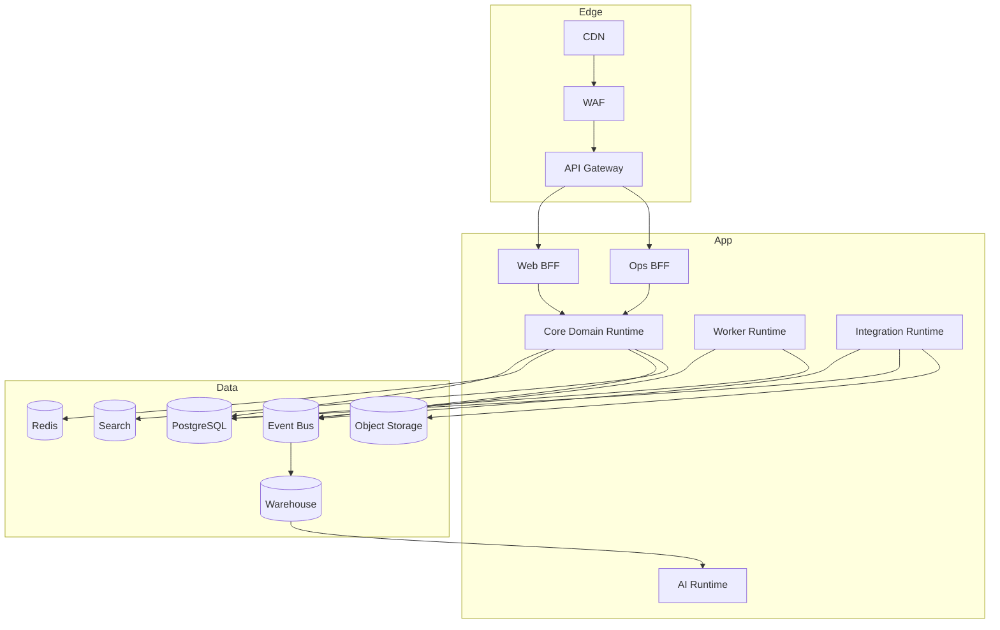

# FoodMesh Architecture

## 1. High-Level System Architecture

FoodMesh is a cloud-native, event-driven, multi-tenant SaaS platform for restaurants and cloud kitchens. The platform centralizes order ingestion from first-party and third-party channels, synchronizes menus and inventory, integrates with POS and external operational systems, and provides analytics and AI-driven decision support.

### Architectural Style

- Modular monolith first, with service extraction boundaries defined from day one.
- Event-driven integration backbone for asynchronous workflows.
- API-first internal design with strict domain ownership.
- Multi-tenant SaaS with logical tenant isolation and scoped data access.
- OLTP and analytics workloads separated to prevent transactional interference.

### Core Runtime Components

- Client Applications
  - Admin Web App
  - Store Operations Console
  - Mobile or tablet kitchen/ops app
  - Public ordering widgets or first-party storefront integrations
- Edge Layer
  - CDN
  - WAF
  - API Gateway
  - Rate limiting and bot protection
- Application Layer
  - Identity and Access Service
  - Tenant Management Service
  - Catalog Service
  - Menu Publishing Service
  - Inventory Service
  - Order Service
  - Fulfillment Service
  - POS Integration Service
  - Channel Connector Service
  - Billing and Subscription Service
  - Notification Service
  - Analytics Ingestion Service
  - AI Intelligence Service
- Data Layer
  - Primary relational database
  - Redis cache
  - Event bus
  - Search index
  - Object storage
  - Data warehouse or lakehouse
- Platform Layer
  - Observability stack
  - Secrets management
  - CI/CD
  - Policy enforcement
  - Backup and disaster recovery

### Context Diagram



### Primary Architectural Principles

- Orders are the most critical workload and always favor correctness over latency spikes.
- External integrations are isolated behind adapters and anti-corruption layers.
- Tenant scoping is enforced in every request path and every data access path.
- Inventory and menu changes are propagated asynchronously with compensating actions.
- Analytics and AI consume immutable events rather than reading hot operational tables directly.

## 2. Low-Level Architecture

### Request Lifecycle

1. A client or external system sends a request through the API Gateway.
2. Identity is validated using OAuth2/OIDC tokens or signed machine credentials.
3. Tenant context is resolved from token claims, domain mapping, API key metadata, or connector configuration.
4. Authorization policy is evaluated against tenant, brand, location, role, and action.
5. The target domain module executes the command or query.
6. The transactional write is committed to the primary database.
7. Domain events are written through an outbox table in the same transaction.
8. An event relay publishes events to the event bus.
9. Downstream consumers update caches, read models, external connectors, and analytics systems.

### Internal Service Topology

- API Gateway
  - North-south traffic management
  - Authentication handoff
  - quota enforcement
  - request tracing
- BFF layer
  - Separate web and operations-facing composition endpoints
  - Aggregates cross-module reads only
- Core domain services
  - Own transactional rules and tables
  - Publish domain events
- Worker tier
  - Handles retries, webhooks, imports, exports, sync jobs, and long-running workflows
- Integration adapters
  - One adapter per external provider class
  - Normalizes provider-specific contracts into canonical internal models

### Core Domain Components

#### Identity and Access

- Users
- Service accounts
- SSO federation
- RBAC with optional ABAC conditions
- Session management
- Audit logging

#### Tenant Management

- Tenant provisioning
- Brand hierarchy
- Location hierarchy
- feature flags
- plan entitlements
- data residency metadata

#### Catalog and Menu

- Product catalog
- Modifier groups
- Pricing rules
- availability windows
- channel-specific mapping
- menu versioning and publish workflows

#### Inventory

- Stock items
- recipe or BOM definitions
- consumption rules
- stock adjustments
- low-stock thresholds
- reservation and release logic for orders

#### Orders

- Canonical order model
- idempotent order intake
- payment state references
- source-channel normalization
- order line pricing snapshots
- lifecycle state machine

#### Fulfillment

- Kitchen workflow
- order acceptance
- prep timing
- handoff status
- cancellation and refund coordination

#### Integrations

- POS sync
- marketplace webhooks
- menu push
- inventory sync
- delivery status sync
- reconciliation jobs

#### Analytics

- Event ingestion
- metrics aggregation
- tenant dashboards
- operational KPIs
- forecast feature inputs

#### AI Intelligence

- Forecasting
- anomaly detection
- menu performance insights
- staffing and replenishment recommendations
- tenant-safe prompt and retrieval pipeline

### Cross-Cutting Patterns

- Outbox pattern for reliable event publication
- Inbox or idempotency tables for webhook and event deduplication
- Saga orchestration for multi-step external workflows
- Read replicas for heavy reporting reads
- Materialized views for operational dashboards
- Circuit breakers and bulkheads for unstable external providers
- Structured audit trails for security and compliance actions

## 3. Database Architecture

### Storage Strategy

- PostgreSQL for primary transactional data
- Redis for cache, distributed locks, idempotency short-term state, and hot reads
- Object storage for menu assets, exports, model artifacts, and raw integration payload archives
- Search engine such as OpenSearch or Elasticsearch for product and order search
- Warehouse such as BigQuery, Snowflake, or Redshift for analytics

### OLTP Database Domains

#### Shared Control Plane Schema

- tenants
- subscriptions
- plans
- feature_flags
- regions
- tenant_settings
- audit_logs

#### Operational Domain Schemas

- iam
  - users
  - roles
  - permissions
  - user_role_bindings
- org
  - brands
  - locations
  - location_hours
  - channel_accounts
- catalog
  - products
  - modifier_groups
  - modifiers
  - price_books
  - menu_versions
  - menu_publications
- inventory
  - stock_items
  - stock_levels
  - recipes
  - stock_movements
  - vendors
  - purchase_orders
- orders
  - orders
  - order_items
  - payments
  - refunds
  - order_status_history
  - order_source_payloads
- fulfillment
  - kitchen_tickets
  - prep_stages
  - dispatch_events
- integrations
  - provider_connections
  - sync_jobs
  - webhook_events
  - reconciliation_results
- messaging
  - notifications
  - notification_deliveries
- platform
  - outbox_events
  - idempotency_keys
  - job_locks

### Relational Design Rules

- Every tenant-owned table includes `tenant_id`.
- Brand and location-scoped tables also include `brand_id` and `location_id` where relevant.
- All foreign keys keep tenant-consistent references.
- Soft delete only where audit retention matters; otherwise use immutable event history plus hard delete policies for non-critical derived data.
- Monetary values stored as integer minor units with explicit currency code.
- Time stored in UTC with tenant-local timezone configuration at the edge and presentation layers.

### Query Segmentation

- Primary writes and critical reads use the writer node.
- Reporting and dashboard reads use replicas or read models.
- Search-heavy queries use the search index rather than relational wildcard scans.
- Historical analytics use warehouse tables populated from event streams and CDC.

### Data Warehouse Model

- Fact tables
  - fact_orders
  - fact_order_items
  - fact_inventory_movements
  - fact_menu_publications
  - fact_channel_syncs
- Dimension tables
  - dim_tenant
  - dim_brand
  - dim_location
  - dim_product
  - dim_channel
  - dim_time
  - dim_user

## 4. Multi-Tenant Architecture

### Tenancy Model

FoodMesh uses pooled multi-tenancy for most workloads with logical isolation at the application and database layers. The design supports selective promotion of strategic or regulated tenants into isolated database or regional deployments without changing the domain model.

### Isolation Levels

- Level 1: Shared application, shared database, row-level isolation
- Level 2: Shared application, dedicated database cluster
- Level 3: Dedicated regional deployment for large enterprise or compliance-bound tenants

### Tenant Resolution

- JWT claims for authenticated users
- API key metadata for machine clients
- mapped connector credentials for external systems
- vanity domain or subdomain mapping for tenant-specific entry points

### Tenant Isolation Controls

- Mandatory `tenant_id` scoping in repositories and query builders
- PostgreSQL row-level security for sensitive shared tables
- authorization policies scoped to tenant, brand, and location
- per-tenant encryption context for secrets and credentials
- per-tenant feature flags and plan entitlements
- per-tenant rate limits and quota enforcement

### Noisy Neighbor Protection

- Queue partitioning by tenant tier
- workload prioritization for order processing
- per-tenant concurrency limits on imports and sync jobs
- rate-limited analytics backfills
- cache key namespacing

### Tenant Lifecycle

1. Provision tenant control-plane records.
2. Configure brand and location hierarchy.
3. Create identity realm mappings and default roles.
4. Issue integration credentials and secrets.
5. Enable plan-bound modules and flags.
6. Seed canonical configuration and observability tags.

## 5. Module Boundaries

### Domain Modules

#### Identity Module

- Owns users, roles, sessions, SSO, and machine credentials.
- Exposes authentication, authorization, and actor context services.
- Does not own tenant business entities.

#### Tenant Module

- Owns tenant metadata, plan entitlements, and organizational hierarchy.
- Exposes tenant resolution, settings, and onboarding APIs.

#### Catalog Module

- Owns products, modifiers, catalog taxonomy, and canonical pricing structures.
- Publishes `CatalogChanged` events.

#### Menu Module

- Owns sellable menu compositions, channel mappings, publishing states, and schedule windows.
- Consumes catalog changes and publishes `MenuPublished` events.

#### Inventory Module

- Owns stock state, recipes, depletion rules, reorder thresholds, and adjustments.
- Publishes `InventoryAdjusted`, `StockReserved`, and `StockReleased`.

#### Order Module

- Owns order intake, validation, pricing snapshot, state machine, and refund orchestration.
- Consumes inventory and menu read models.
- Publishes `OrderCreated`, `OrderAccepted`, `OrderCancelled`, `OrderCompleted`.

#### Fulfillment Module

- Owns prep workflow, kitchen tickets, dispatch readiness, and SLA monitoring.
- Consumes order events.

#### Integration Module

- Owns provider credentials, adapters, sync jobs, webhook processing, and reconciliation.
- No other module calls provider APIs directly.

#### Billing Module

- Owns subscription state, invoices, usage meters, and plan enforcement hooks.

#### Analytics Module

- Owns KPI definitions, reporting read models, semantic metrics layer, and warehouse exports.

#### AI Module

- Owns feature generation, model invocation, recommendation pipelines, and safety filters.
- Reads operational and warehouse data through curated interfaces only.

### Boundary Rules

- Modules own their write models.
- Cross-module reads happen through APIs, projections, or replicated read models.
- Shared database access across module boundaries is forbidden.
- External provider logic stays inside the Integration Module.
- AI services cannot directly mutate operational records without passing through domain APIs.

## 6. Event Flow Diagrams

### Order Intake Flow



### Menu Publish Flow



### Inventory Depletion Flow



### Analytics and AI Flow



## 7. API Design Standards

### API Style

- External APIs use REST over HTTPS for operational simplicity.
- Internal asynchronous workflows use events.
- Internal synchronous calls use versioned HTTP or gRPC where latency matters.

### Resource Standards

- Base path: `/api/v1`
- Tenant context is derived from auth and routing, not from arbitrary client-submitted identifiers alone.
- Use nouns for resources and explicit action subpaths only for non-CRUD domain actions.

Examples:

- `POST /api/v1/orders`
- `GET /api/v1/orders/{orderId}`
- `POST /api/v1/orders/{orderId}/accept`
- `POST /api/v1/menu-publications`
- `POST /api/v1/inventory/adjustments`

### Request and Response Conventions

- JSON request and response bodies
- ISO-8601 timestamps
- opaque UUID or ULID identifiers
- standard pagination with cursor-based pagination for large collections
- idempotency key required for unsafe external write endpoints
- correlation ID and request ID propagated in headers

### Error Contract

- Stable machine-readable error code
- Human-readable message
- trace identifier
- field-level validation errors when relevant

Example shape:

```json
{
  "error": {
    "code": "inventory.insufficient_stock",
    "message": "Insufficient stock for one or more order items.",
    "traceId": "01J...",
    "details": [
      {
        "field": "items[1].quantity",
        "reason": "exceeds_available_stock"
      }
    ]
  }
}
```

### API Governance

- Backward-compatible additions only within a version
- breaking changes require a new version
- OpenAPI contracts are the source of truth
- schema linting, contract tests, and consumer compatibility tests are mandatory
- webhook signatures and replay protections required for provider callbacks

## 8. Folder Structure

The repository should reflect domain boundaries rather than technical layers alone.

```text
foodmesh/
  docs/
    architecture.md
    adr/
    api/
    runbooks/
  apps/
    admin-web/
    ops-console/
    storefront-sdk/
  services/
    gateway/
    bff-web/
    bff-ops/
    worker/
  domains/
    identity/
      api/
      application/
      domain/
      infrastructure/
      tests/
    tenant/
    catalog/
    menu/
    inventory/
    orders/
    fulfillment/
    integrations/
    billing/
    analytics/
    ai/
  packages/
    contracts/
    events/
    shared-kernel/
    observability/
    authz/
    testing/
  platform/
    terraform/
    kubernetes/
    monitoring/
    data-platform/
  scripts/
  .github/
```

### Folder Design Rules

- `domains/` contains business modules with explicit application, domain, and infrastructure layers.
- `packages/shared-kernel` must stay small and contain only truly shared abstractions.
- provider-specific code belongs under `domains/integrations`.
- cross-cutting platform code does not leak domain rules.
- `docs/adr` holds architectural decision records for irreversible choices.

## 9. Scalability Plan

### Phase 1: Foundation

- Single regional deployment
- modular monolith for core domains
- managed PostgreSQL with replicas
- Redis cache
- message bus for async jobs and events
- warehouse fed daily or near-real-time from CDC

Target:

- Small to mid-market restaurant groups
- low operational overhead
- fast feature iteration

### Phase 2: Growth

- Extract high-churn or high-throughput components
  - Channel Connector Service
  - POS Integration Service
  - Analytics Ingestion Service
  - AI Intelligence Service
- Introduce partitioned job queues
- use read models and search index broadly
- deploy multiple worker pools by workload class

Target:

- High connector volume
- higher order throughput
- stricter isolation for unstable integrations

### Phase 3: Enterprise Scale

- Tenant tier-based deployment topology
- dedicated data plane for regulated or very large tenants
- regional failover
- multi-cluster runtime
- warehouse and feature-store scale-out
- online archiving and data lifecycle automation

### Scaling Dimensions

- Compute scale
  - stateless API services horizontally autoscaled
- Data scale
  - read replicas, partitioning, retention policies, warehouse offload
- Queue scale
  - separate queues for orders, menu sync, inventory sync, analytics, notifications
- Integration scale
  - per-provider worker pools and rate-limit enforcement
- Tenant scale
  - tenant-aware sharding or database promotion path

### Data Partitioning Strategy

- Start with partitioning large append-heavy tables by time and optionally tenant tier.
- Prioritize partitioning for:
  - orders
  - order_status_history
  - stock_movements
  - webhook_events
  - outbox_events
  - audit_logs

## 10. Security Architecture

### Identity and Access Security

- OAuth2/OIDC for human users
- SAML SSO for enterprise tenants
- short-lived access tokens
- refresh token rotation
- service-to-service auth via workload identity or signed client credentials
- RBAC with location-level and brand-level scopes

### Data Security

- TLS everywhere in transit
- encryption at rest for databases, caches, and object storage
- secrets stored in a managed secret vault
- provider credentials encrypted with tenant-scoped key metadata
- PII minimization and retention controls

### Application Security

- secure defaults for headers, CORS, CSRF, and session handling
- WAF and rate limiting at the edge
- webhook signature verification
- request validation at gateway and service boundaries
- strict output encoding in user-facing applications
- SSRF and egress controls on integration workers

### Tenant Security

- tenant-scoped authorization in every service
- row-level isolation controls in shared persistence
- tenant-aware audit trails
- tenant-specific API credentials and revocation

### Platform Security

- least-privilege IAM
- isolated runtime identities per service
- signed container images
- SBOM generation and vulnerability scanning
- infrastructure policy as code
- immutable audit logs for security-sensitive actions

### Monitoring and Response

- centralized security event logging
- anomaly detection for login, order, and credential misuse patterns
- alerting on privilege changes, failed webhook signatures, unusual export volume, and cross-tenant access violations
- backup verification and disaster recovery drills

### Compliance Readiness

- PCI scope minimized through tokenized payment provider integrations
- GDPR and regional privacy controls through retention and subject request workflows
- SOC 2 readiness through controls over access, auditability, change management, and vendor management

## Recommended Deployment Topology



## Final Architectural Position

FoodMesh should be built as a domain-modular, event-driven SaaS platform with pooled multi-tenancy by default, strong tenant isolation controls, a relational operational core, and a separate analytics and AI data plane. The initial implementation should stay deployment-simple while preserving clean extraction boundaries for orders, inventory, menus, integrations, analytics, and AI as scale and tenant sophistication increase.
